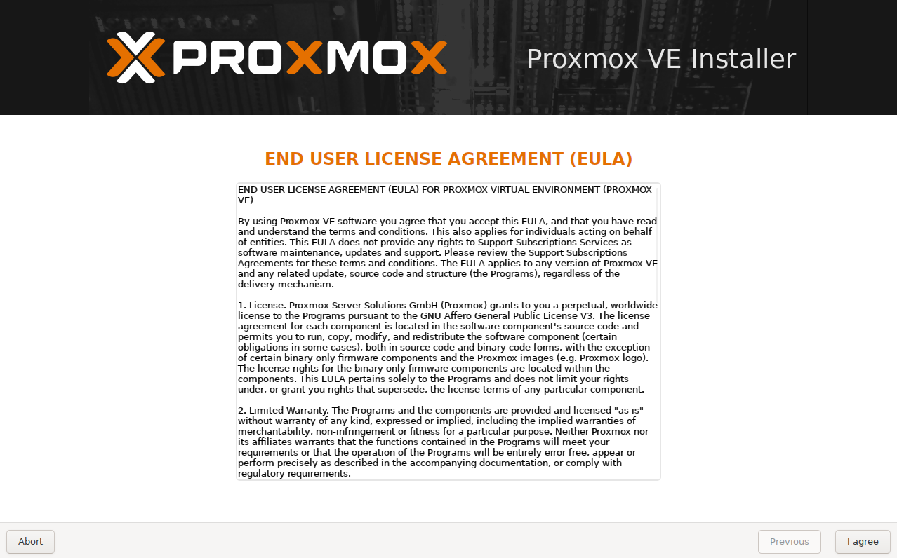
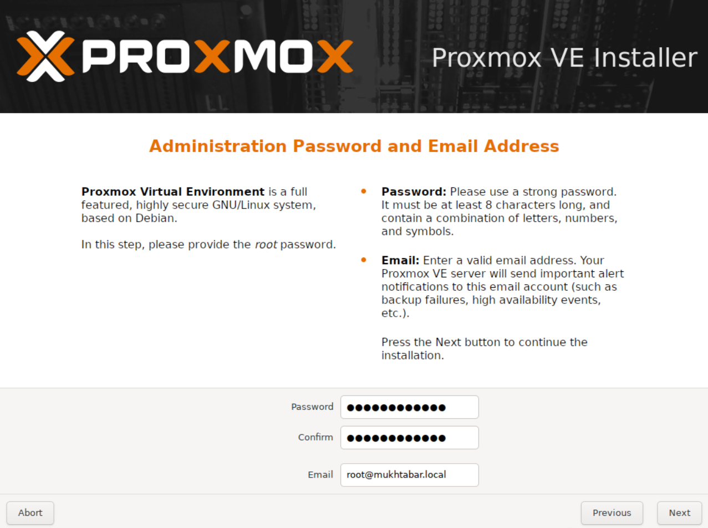
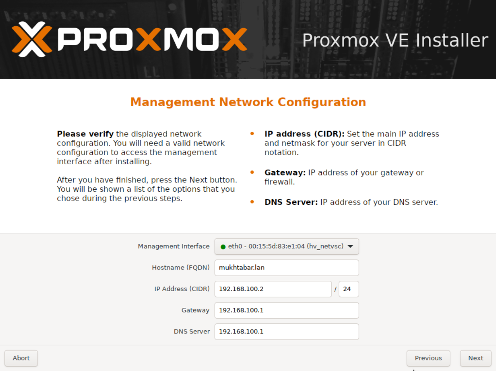
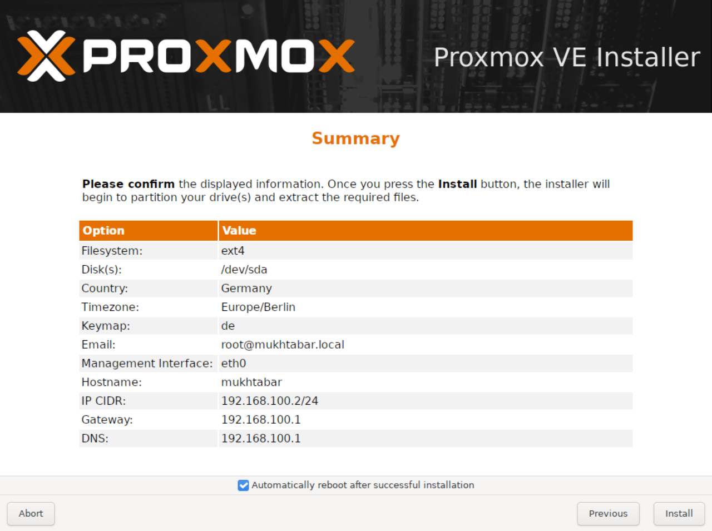
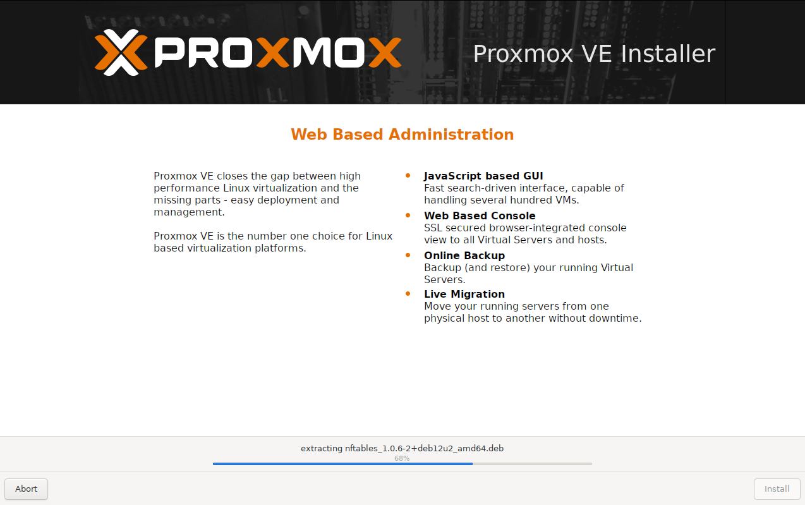
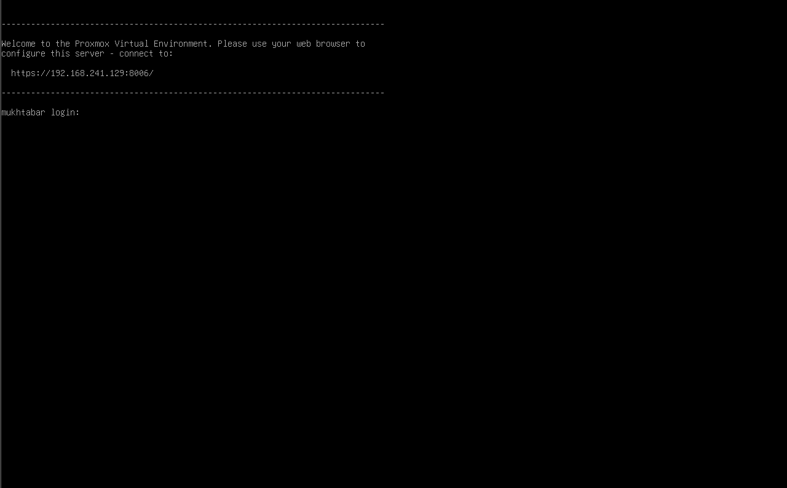
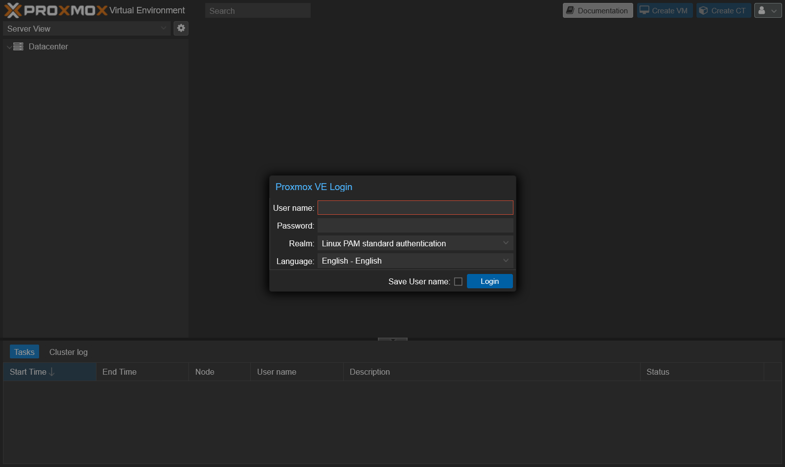

# Proxmox

This guide provides step-by-step instructions for installing and configuring Proxmox VE. Proxmox serves as the foundational hypervisor, hosting all other core components—such as OPNsense, and GitLab—as virtual machines. This document covers the entire process, from initial hardware preparation and OS installation to essential post-installation tasks required to build a robust and flexible virtualization platform.

## Table of Contents

- [Proxmox](#proxmox)
  - [Preparation Steps](#preparation-steps)
    - [ISO Download](#iso-download)
  - [Installation](#installation)
  - [Post-Installation Tasks](#post-installation-tasks)
    - [Login](#login)
    - [Initial System Configuration & Update](#initial-system-configuration--update)
    - [PCI(e) Passthrough (_optional_)](#pcie-passthrough-optional)
    - [Disk Layout Adjustment](#disk-layout-adjustment)
    - [Network Configuration](#network-configuration)

## Preparation Steps

### ISO Download

To install Proxmox VE, download the Proxmox ISO image from the [official website](https://www.proxmox.com/en/downloads/proxmox-virtual-environment). For this setup, we are using version **8.4-1**.


> Use a tool like [Rufus](https://rufus.ie/) or [balenaEtcher](https://www.balena.io/etcher/) to create a bootable USB drive with the ISO. Ensure you have a reliable USB stick (at least 4 GB) and verify the download checksum for integrity before proceeding.

Before installing Proxmox VE, ensure the following preparation steps are completed:

1. **Update BIOS:** Update the BIOS of your chosen hardware to the latest version available from the official support site.
2. **Enable Virtualization:** In the BIOS settings, enable virtualization technologies (Intel VT-x and VT-d or AMD-V).
3. **Configure Boot Mode:** Set the boot mode to UEFI for better compatibility and performance.
4. **Enable USB Boot:** Ensure that booting from a USB device is enabled.
5. **Connect Network:** Connect the system to your network using an Ethernet cable.

## Installation

Insert the prepared USB drive into the machine and power on the system. Select the USB drive as the boot device from the BIOS/UEFI boot menu to start the Proxmox installer. Select "Install Proxmox VE (Graphical)", read the EULA, and click "I agree" to continue.




> 💡 Sometimes the graphical installer may have compatibility issues with certain graphics cards, resulting in the screen being cut off at the bottom and preventing you from completing the installation. If you encounter this problem, use the "Terminal UI" option instead, which provides a text-based installation.

Choose the target disk for installation. For this setup, we will use the default option and allow Proxmox to automatically partition the disk.


> 💡If you have specific reasons or requirements, you can customize the disk partitions during installation by clicking on "Options". Refer to the [Advanced LVM Configuration Options](https://pve.proxmox.com/pve-docs/chapter-pve-installation.html#advanced_lvm_options) in the official Proxmox documentation for detailed guidance.

Select your country, time zone, and preferred keyboard layout. This ensures that your system clock and input settings are correctly configured for your region.


Set a strong password for the root user and confirm it. Enter an email address to receive system notifications from Proxmox. If you do not wish to use a real email, you can enter a placeholder address.



Configure the hostname and domain for your Proxmox server to identify it on your local network. Assign a static IP address, gateway, and DNS server according to your network setup.



Review all the settings and information on the summary screen to ensure they match your configuration. Once you are satisfied, click "Install" to begin the installation process.





Once the installation is complete, the system will automatically reboot. On startup, Proxmox VE will display the IP address and port (usually `https://your-ip-address:8006`) to access the web interface. Use this address in your browser to log in and begin configuring your Proxmox environment.



## Post-Installation Tasks

### Login

Log in using the username `root` and the password you set during the Proxmox VE installation. This will grant you administrative access to the web interface, where you can begin configuring and managing your virtual environment.



> 💡 After logging in for the first time, you will see a dialog about a subscription. You can simply ignore this message and click "OK" to access the Proxmox web interface. If you wish to remove this notification, there are methods available which will be covered later in the documentation.
> 

### Initial System Configuration & Update

Now that the installation is complete, it's important to update the system and adjust key settings.

To automate post-install tasks, download and run the initialization script from this repository:

**[View pve_init.sh](../../scripts/proxmox/pve_init.sh)**

Or

To download and execute the script directly, click on your node, navigate to "Shell", run the following commands:

```bash
apt update && apt install -y curl
bash -c "$(curl -fsSL https://raw.githubusercontent.com/Proless/Mukhtabar/main/scripts/pve_init.sh)"
```

The script will update repositories, remove the subscription notification, and apply system updates.

After the script finishes running, the system will reboot automatically.

### PCI(e) Passthrough (_optional_)

This step is optional and only required if you plan to use PCI(e) passthrough for VMs that need direct access to physical hardware (such as disks or network cards). If you do not require passthrough functionality, you can safely skip this section.

To enable PCI(e) Passthrough in Proxmox. You can follow the official guide here: [PCI(e) Passthrough](<https://pve.proxmox.com/wiki/PCI(e)_Passthrough>).

1. Update package lists and install a text editor:

   ```bash
   apt update && apt install -y nano
   ```

2. Edit the GRUB configuration to enable IOMMU. Open `/etc/default/grub` and modify the `GRUB_CMDLINE_LINUX_DEFAULT` line to include `intel_iommu=on`:

   ```bash
   nano /etc/default/grub
   ```

   Change the line to:

   ```bash
   GRUB_CMDLINE_LINUX_DEFAULT="quiet intel_iommu=on"
   ```

   Save and exit.

3. Update GRUB:

   ```bash
   update-grub
   ```

4. Add required kernel modules for PCI(e) passthrough. Edit `/etc/modules` and add the following lines:

   ```bash
   nano /etc/modules
   ```

   Add:

   ```bash
   vfio
   vfio_iommu_type1
   vfio_pci
   vfio_virqfd
   ```

   Save and exit.

5. Update the initramfs:

   ```bash
   update-initramfs -u -k all
   ```

6. Reboot the system to apply all changes:

   ```bash
   reboot
   ```

### Disk Layout Adjustment

Now we need to adjust the disk layout, as LVM is not necessary for this setup. But removing it also has certain disadvantages (see 'Directory' in [Storage](https://pve.proxmox.com/wiki/Storage) for more details).

1. In the Proxmox web interface, click on “Datacenter” and then select “Storage”
2. Click on “local-lvm” and choose “Remove”
   (_Note: Removing local-lvm is safe in this fresh install_)
3. Now, select “local” from the storage list and click "Edit." In the "Content" drop-down menu, select all available options to allow the storage to handle various types of data (e.g., Disk images, backups, containers, etc.). Confirm your changes by clicking "OK"
4. After removal of “local-lvm”, click on your node and open the “Shell”
5. Run the following commands to remove the LVM data volume and expand the root volume:

   ```bash
   lvremove /dev/pve/data
   lvresize -l +100%FREE /dev/pve/root
   resize2fs /dev/mapper/pve-root
   ```

Once completed, your “local” storage should increase to the maximum size available on your hard drive.


### Network Configuration

To fit our setup and goals, we need to configure the network interfaces in Proxmox. Follow these steps:

1. Navigate to "Shell" in the Proxmox web interface.
2. Execute `nano /etc/network/interfaces` to edit the network configuration file. The initial configuration will look similar to:

   ```bash
   auto lo
   iface lo inet loopback

   iface enp1s0 inet manual

   auto vmbr0
   iface vmbr0 inet static
           address 192.168.241.129/24
           gateway 192.168.241.2
           bridge-ports enp1s0
           bridge-stp off
           bridge-fd 0

   source /etc/network/interfaces.d/*
   ```

   > 💡 Make a note of your network interface name (e.g., `enp1s0`). The interface name may vary depending on your hardware and installation. Replace `enp1s0` in the configuration examples with the actual name of your network interface

3. Replace the content with the following configuration to add two more interfaces for the OPNsense VM. You can set `vmbr0` to use DHCP for portability, allowing "plug and play" in any network with a properly configured router.

   ```bash
   auto lo
   iface lo inet loopback

   iface enp1s0 inet manual

   auto vmbr0
   iface vmbr0 inet dhcp
           bridge-ports enp1s0
           bridge-stp off
           bridge-fd 0
           post-up echo 1 > /proc/sys/net/ipv4/ip_forward
           post-up iptables -t nat -A PREROUTING -i vmbr0 -p tcp -m multiport ! --dport 22,8006 -j DNAT --to 172.16.1.1
           post-up iptables -t nat -A PREROUTING -i vmbr0 -p udp -m multiport ! --dport 22,8006 -j DNAT --to 172.16.1.1
           post-down iptables -t nat -D PREROUTING -i vmbr0 -p tcp -m multiport ! --dport 22,8006 -j DNAT --to 172.16.1.1
           post-down iptables -t nat -D PREROUTING -i vmbr0 -p udp -m multiport ! --dport 22,8006 -j DNAT --to 172.16.1.1

   auto vmbr1
   iface vmbr1 inet static
           address 172.16.1.0/31
           bridge-ports none
           bridge-stp off
           bridge-fd 0
           post-up iptables -t nat -A POSTROUTING -s '172.16.1.1/31' -o vmbr0 -j MASQUERADE
           post-down iptables -t nat -D POSTROUTING -s '172.16.1.1/31' -o vmbr0 -j MASQUERADE
   # OPNsense WAN

   auto vmbr2
   iface vmbr2 inet static
           bridge-ports none
           bridge-stp off
           bridge-fd 0
           bridge-vlan-aware yes
           bridge-vids 2-4094
   # OPNsense LAN

   source /etc/network/interfaces.d/*
   ```

   > 💡 Ensure your local network subnet does not conflict with the `172.16.1.0/24` subnet used here. If you choose a different subnet, remember to update all related configurations throughout your setup. Additional network adjustments may be required, which will be covered in a future guide.

4. Save and exit the editor.
5. Reboot the system to apply the new network configuration
