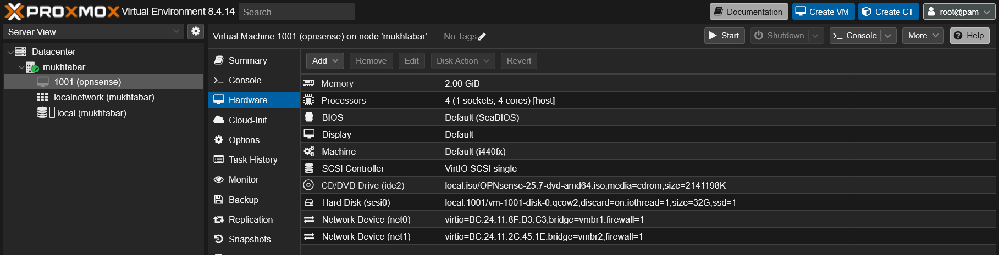
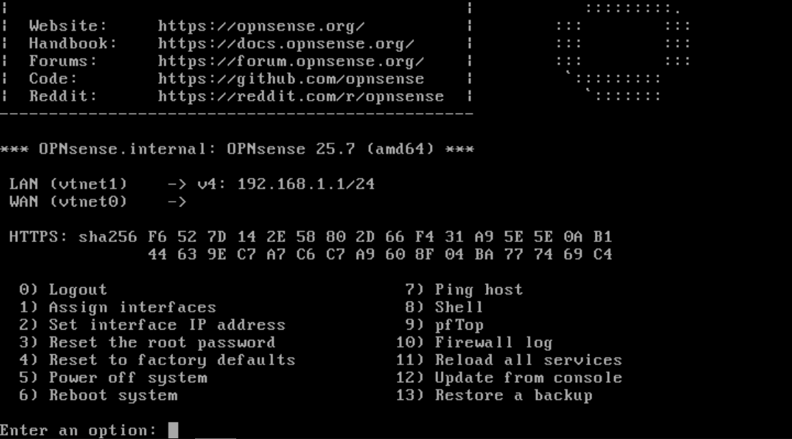
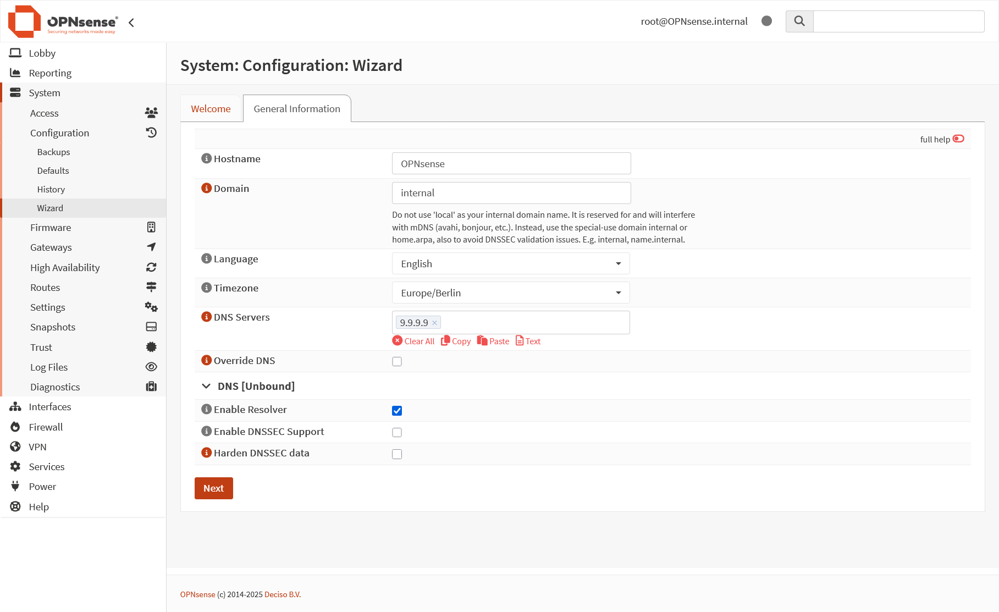
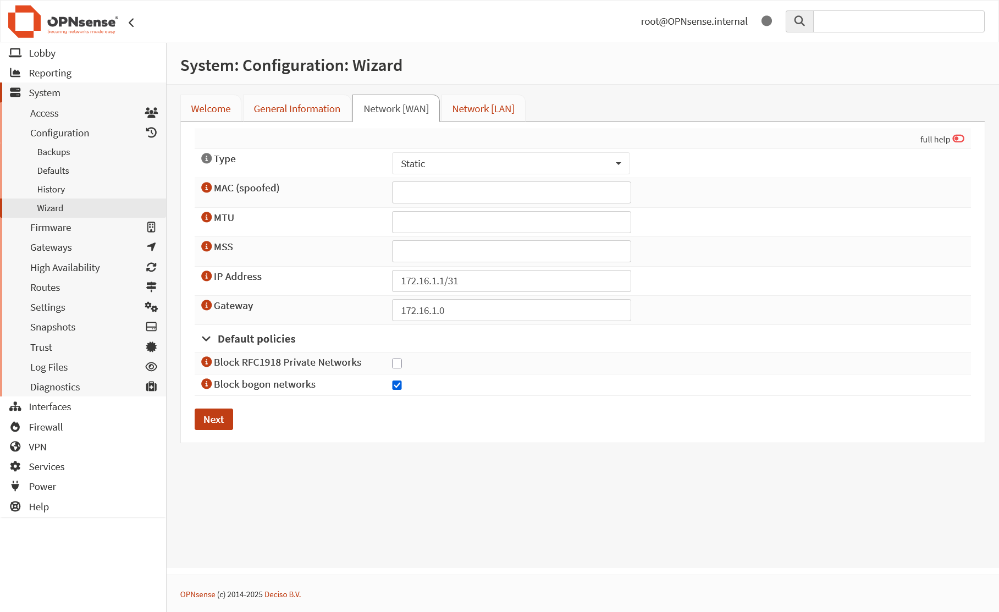
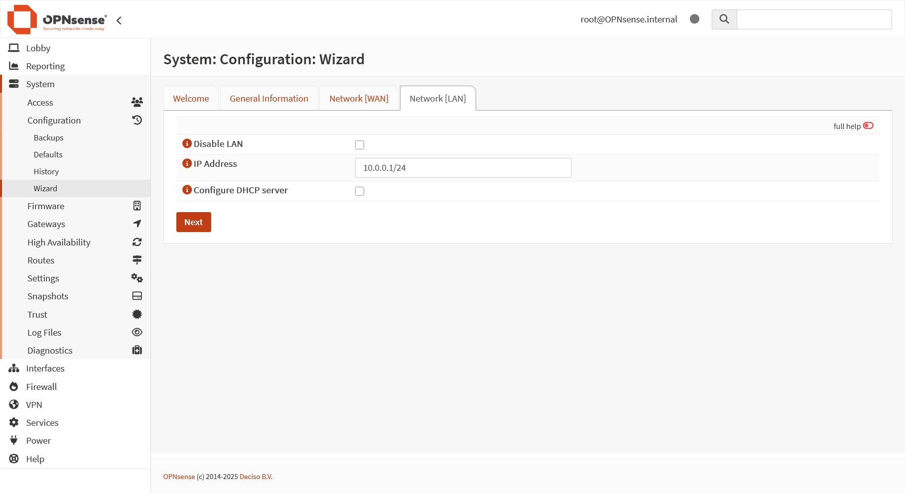
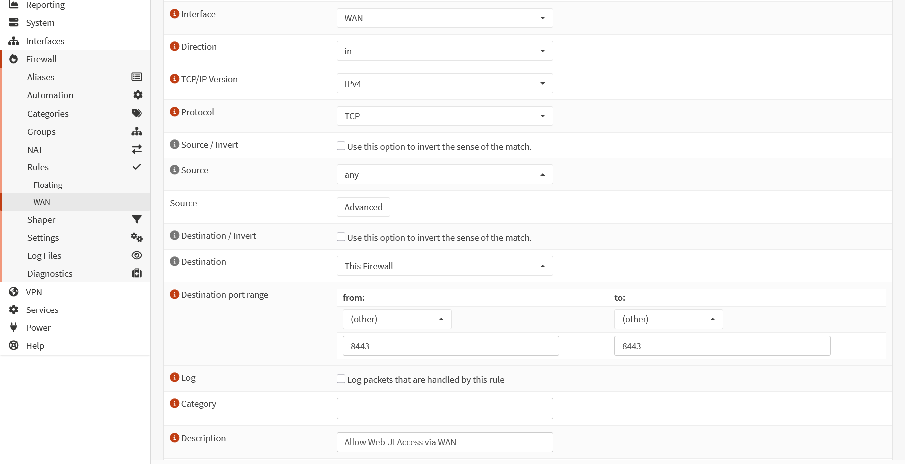
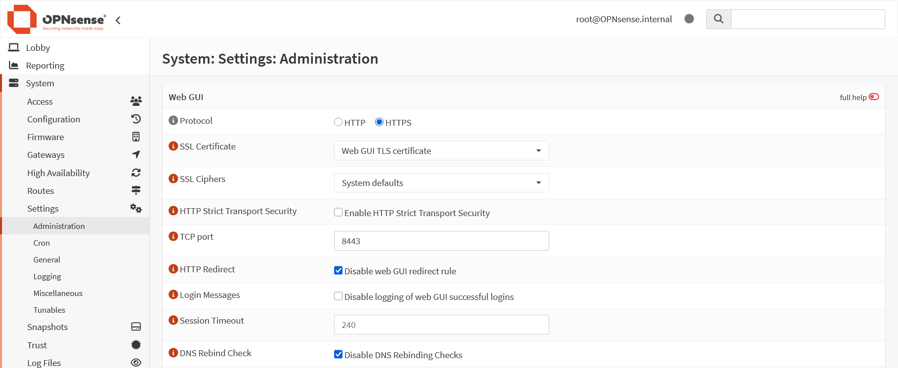
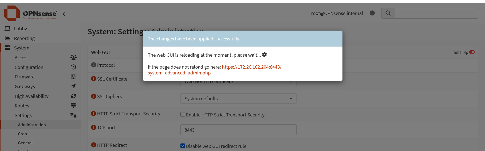
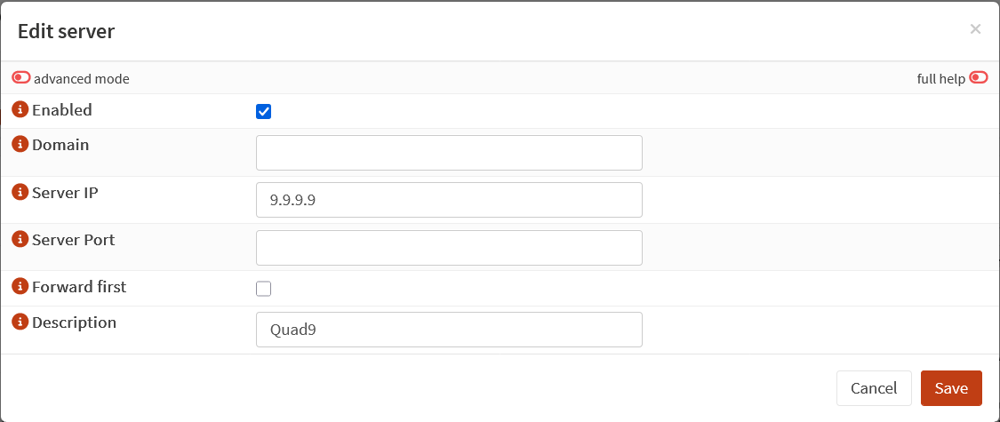

# OPNsense

This guide covers the installation and configuration of OPNsense, an open-source firewall and routing platform. OPNsense runs as a virtual machine and serves as the central gateway, managing all network traffic for the virtualized services. It will be configured to provide essential network services like DHCP and DNS, segment the network using VLANs, and handle advanced functions such as load balancing and reverse proxying.

## Table of Contents

- [OPNsense](#opnsense)
  - [Preparation Steps](#preparation-steps)
    - [ISO Download](#iso-download)
    - [Proxmox Virtual Machine](#proxmox-virtual-machine)
  - [Installation](#installation)
  - [Post-Installation Tasks](#post-installation-tasks)
    - [WAN Interface](#wan-interface)
    - [LAN Interface](#lan-interface)
    - [Initial Configuration](#initial-configuration)
    - [Web UI Firewall Rule](#web-ui-firewall-rule)
    - [Web UI Port](#web-ui-port)
    - [DNS](#dns)
    - [DHCP](#dhcp)
    - [Update OPNsense](#update-opnsense)

## Preparation Steps

### ISO Download

To install OPNsense, download the OPNsense ISO image from the [official website](https://opnsense.org/download). For this setup, we are using version **25.7**.


Once the ISO is downloaded, you need to upload it to Proxmox so it can be used to create a virtual machine.

1. **Navigate to Storage:** In the Proxmox web UI, select your node in the left-hand server view, then click on the `local` storage.
2. **Open ISO Images:** In the center pane, select the `ISO Images` tab.
3. **Upload the File:** Click the `Upload` button. In the dialog that appears, click `Select File` and choose the OPNsense ISO you downloaded.
4. **Confirm Upload:** Click `Upload` again to begin the transfer.


> 💡 To save time, you can download the ISO directly to Proxmox. Instead of `Upload`, click `Download from URL` in the `ISO Images` view, paste the download link, and click `Download`. This avoids having to first download the file to your computer.

After the upload/download is complete, the OPNsense ISO will be available to attach to a new VM during the creation process.


### Proxmox Virtual Machine

Create the virtual machine for OPNsense. In the Proxmox web UI, click the `Create VM` button in the top-right corner to launch the VM creation wizard. Enable the `Advanced` checkbox in the bottom-right of the dialog. Proceed through each tab and configure the settings as described in the following steps.


#### General Tab

- **Name:** `opnsense`
- **VM ID:** `1001`
- **Start at boot:** checked
- **Start/Shutdown order:** `1`

#### OS Tab

- **Use CD/DVD disc image file (iso):** selected
- **Storage:** `local`
- **ISO Image:** `OPNsense-25.7-dvd-amd64.iso`
- **Type:** `Linux`
- **Version:** `6.X - 2.6 Kernel`

#### System Tab

- **Machine:** Default (`i440fx`)
- **BIOS:** Default (`SeaBIOS`)
- **SCSI Controller:** `VirtIO SCSI single`
- **Qemu Agent:** checked

#### Disks Tab

- **Storage:** `local`
- **Disk size (GiB):** `32`
- **Format:** `QEMU image format (qcow2)`
- **Discard:** checked
- **SSD emulation:** checked

#### CPU Tab

- **Cores:** `4`
- **Type:** `host`

#### Memory Tab

- **Memory (MiB):** `2048`
- **Minimum memory (MiB):** `2048`
- **Ballooning Device:** checked

#### Network Tab

- **Bridge:** `vmbr1`
- **Model:** `VirtIO (paravirtualized)`


#### Network Devices

To add a LAN interface to OPNsense. Go back to the proxmox Web UI and navigate and select the OPNsens VM then go to `Hardware`. Click `Add` → `Network Device`. Choose the bridge `vmbr2` and click `Add`

Now you should have two network devices added to the VM: one will serve as the WAN interface and the other as the LAN interface in OPNsense.

- The **WAN interface** connects the OPNsense VM to your external or upstream network (typically your home network or lab uplink), allowing it to act as the gateway for all outbound and inbound traffic.
- The **LAN interface** connects the OPNsense VM to your internal virtual network, providing routing, firewall, DHCP, and DNS services to your virtual machines and containers.



## Installation

Select the newly created VM `1001 (opnsense)` and open the `Console` tab. Click `Start` to power on the VM. The system will boot from the OPNsense ISO in live mode initially.


At the boot prompt, you can simply wait for the system to autoboot—no user input is required at this stage.


Once the system begins initialization, you may see prompts to configure certain options. Wait until you see the message: **"Press any key to start the manual interface assignment"** At this point, press any key to proceed with assigning a network interface for WAN.

- You will be prompted to configure LAGGs and VLANs. For both prompts, simply press `Enter` to accept the default answer of "No," as these features are not required at this stage of the setup.

Next, answer the following prompts as shown below. After typing each value, press `Enter` to confirm your entry.

- **Enter the WAN interface name:** `vtnet0`
- **Enter the LAN interface name:** `vtnet1`
- **Enter the Optional interface name:** _(leave blank and press Enter)_

After entering both interface names, type `y` and press `Enter` to confirm your selections and proceed with the initial network configuration. OPNsense will now apply these settings and continue with the setup process.


Once the interfaces are configured and you see the login prompt, you are ready to begin the actual installation of OPNsense onto the virtual machine.

Log in using the username `installer` and the password `opnsense`. This will launch the OPNsense installer, allowing you to proceed with the guided installation process.


Select your preferred keyboard layout and continue. When prompted, choose the `Install (UFS)` option to begin the installation. You may see a warning about the system having only 2048 MB of RAM—this can be safely ignored for our setup and usage purposes. Click `Proceed anyway` to continue with the installation process.


Select the 32 GB disk as the installation target for OPNsense. When prompted about creating a recommended swap partition, choose `No`—this is optional and not required. Confirm your disk selection by choosing `YES` when asked to proceed. The installer will now copy the necessary files and complete the installation process. Wait for the installation to finish before continuing to the next steps.


Next, you will be prompted to set the `Root password` for the root user. Enter a strong password of your choice twice to confirm. This password will be used for administrative access to the OPNsense web interface and console.

After setting the password, select `Complete Install` to finalize the installation. Then choose `Reboot now` to restart the system and complete the installation process.


## Post-Installation Tasks

After the VM has rebooted, you can log in using the username `root` and the password you set during installation. Upon successful login, you will see the OPNsense console menu, as shown in the screenshot below.

From here, you can proceed with the initial configuration of OPNsense. This includes assigning IP addresses, setting up the WAN and LAN interfaces and adding a firewall rule to allow Access to the Web UI via WAN. Follow the next steps in this guide to complete the setup and ensure your OPNsense firewall is ready to manage our virtual network.



### WAN Interface

Now we need to configure the WAN interface by assigning it a static IP address and setting the gateway. From the OPNsense Console menu, enter `2` to select `Set interface IP address` → `2` to select `WAN` . For each prompt, respond as follows (`n` stands for No):

- **Configure IPv4 address WAN interface via DHCP?**: `n`
- **Enter the new WAN IPv4 address**: `172.16.1.1`
- **Enter the new WAN IPv4 subnet bit count**: `31`
- **For a WAN, enter the new WAN IPv4 upstream gateway address**: `172.16.1.0`
- **Do you want to use the gateway as the IPv4 name server?**: `n`
- **Enter the IPv4 name server**: `9.9.9.9`  
  _(Note: This is a temporary setting; you can change the DNS server later through the OPNsense Web UI.)_
- **Configure IPv6 address WAN interface via DHCP6**: `n`
- **Enter the new WAN IPv6 address**: _(leave blank and press Enter, as IPv6 is not needed for this setup)_

For any additional prompts, simply press `Enter` to accept the default answer, which should be `n`.

### LAN Interface

Now we need to configure the LAN interface. From the OPNsense Console menu, enter `2` to select `Set interface IP address` → `1` to select `LAN` . For each prompt, respond as follows (`n` stands for No):

- **Configure IPv4 address LAN interface via DHCP?**: `n`
- **Enter the new LAN IPv4 address**: `10.0.0.1`
- **Enter the new LAN IPv4 subnet bit count**: `24`
- **For a LAN**: _(leave blank and press Enter)_
- **Configure IPv6 address LAN interface via DHCP6**: `n`
- **Enter the new LAN IPv6 address**: _(leave blank and press Enter, as IPv6 is not needed for this setup)_
- **Do you want to enable DHCP server on LAN?**: `n`
  _(Note: We will configure a DHCP server through the Web UI later)_

For any additional prompts, simply press `Enter` to accept the default answer, which should be `n`.

### Initial Configuration

Now that the WAN and LAN interfaces are configured, you need to adjust some settings to ensure access to the web interface from your Proxmox host and to prevent issues with HTTP referer and DNS rebind checks.

1. From the OPNsense Console menu, select option `8` to open the `Shell`.
2. Edit the configuration file by running:

   ```shell
   vi /conf/config.xml
   ```

3. Scroll down to the `<webgui>` section and add the following lines:

   ```xml
   <nohttpreferercheck>1</nohttpreferercheck>
   <nodnsrebindcheck>1</nodnsrebindcheck>
   ```

   The `<webgui>` section should look like this:

   ```xml
   <webgui>
         <protocol>https</protocol>
         <nohttpreferercheck>1</nohttpreferercheck>
         <nodnsrebindcheck>1</nodnsrebindcheck>
         <!-- This can be different, which is fine. -->
         <ssl-certref>68e565efcf5d8</ssl-certref>
   </webgui>
   ```

4. Save the file and exit the editor.
5. Back in the console menu, select option `6` to `Reboot system` and apply the changes.

OPNsense blocks access to the Web UI via the WAN address by default to enhance security. However, for initial setup, we need to temporarily disable the firewall filter and add a rule to allow access through the WAN interface.

To do this:

1. From the OPNsense Console menu, select option `8` to open the `Shell`.
2. Temporarily disable the firewall filter by running `pfctl -d`

   (_Note: This command disables packet filtering, allowing you to access the Web UI via the WAN interface_)

Now, you should be able to access the OPNsense Web UI using the IP address or the hostname assigned to your Proxmox host. For example, navigate to `https://192.168.22.120` or `https://mukhtabar.lan` in your web browser.

When you first connect, your browser may display a warning about the SSL certificate being self-signed. This is normal for a fresh OPNsense installation—simply accept the warning to proceed.

You will then be presented with the OPNsense login page. Log in using the username `root` and the password you set during installation. Once logged in, you will be greeted by the OPNsense welcome wizard. Click `Next` to proceed to the general settings page.


#### General

- **Domain Name:** Set the domain name to anything of your choosing. For internal use, avoid using real top-level domains (TLDs); instead, use something like `internal`, `lab` or `home`.
- **Timezone:** Adjust the timezone to match your location.
- **Override DNS:** Uncheck the `Override DNS` option to prevent OPNsense from replacing your custom DNS settings with those provided by the WAN interface.
- **Language:** You may change the language if desired, but this guide uses English terms and menus for consistency.

Once you have made these adjustments, click `Next` to continue with the wizard and complete the initial configuration.



#### WAN

On the Network [WAN] page of the OPNsense setup wizard, ensure the following settings are configured:

- **Type:** Set to `Static`.
- **IP Address:** Enter `172.16.1.1/31`.
- **Gateway:** Enter `172.16.1.0`.
- **Block RFC1918 Private Networks:** Make sure this option is **unchecked**. This allows private network traffic to reach the WAN interface, which is necessary in a virtualized lab environment where your WAN is not truly public.



#### LAN

On the Network [LAN] page of the OPNsense setup wizard, ensure the following settings are configured:

- **Disable LAN** `Unchecked`
- **IP Address** `10.0.0.1/24`
- **Configure DHCP Server**: `Unchecked`



Once you have verified the configuration, continue by clicking `Next` through the remaining pages of the setup wizard.

When you reach the end of the wizard, click `Apply` to save your configuration and complete the initial setup.

> **Note:** After applying the configuration, OPNsense will automatically re-enable the firewall, which may block your current access to the Web UI via the WAN interface. This is a security feature to prevent unauthorized access.

To regain access for final adjustments, return to the OPNsense console and temporarily disable the firewall filter again by running `pfctl -d`. This will allow you to continue configuring OPNsense through the Web UI. Remember, this step is only necessary during initial setup.

#### Web UI Firewall Rule

To ensure you can access the Web UI via the WAN address before configuring a LAN interface, you need to add a firewall rule that explicitly allows this access:

1. In the OPNsense Web UI, navigate to `Firewall` → `Rules` → `WAN`.
2. Click the plus (+) button to add a new rule.
3. Set the following values:
   - **Action:** `Pass`
   - **Interface:** `WAN`
   - **Direction:** `In`
   - **TCP/IP Version:** `IPv4`
   - **Protocol:** `TCP`
   - **Destination:** `This Firewall`
   - **Destination port range:** Select `other` and enter `8443` in both fields (the custom port we will configure for the Web UI).
   - **Description:** `Allow Web UI Access via WAN`
4. Click `Save` to add the rule, then click `Apply changes` at the top to activate it.
5. From the Shell, run `pfctl -d`.



This rule ensures that you can reliably access the OPNsense Web UI from your Proxmox host or any management workstation on your network, even before the LAN interface is configured.

In this setup, the WAN interface is the private network (e.g., home network) that the Proxmox host is connected to, so allowing Web UI access via WAN is acceptable. However, if the WAN interface is assigned a true public IP address, you should remove or restrict this rule after configuring the LAN interface to prevent exposing the OPNsense Web UI to the internet.

#### Web UI Port

Next we need to change the default web interface port and adjust redirect settings:

1. Navigate to `System` → `Settings` → `Administration`.
2. Set the **TCP Port** to `8443` (or another port of your choice).
3. Uncheck the option labeled **Disable web GUI redirect rule** next to HTTP Redirect.
4. Scroll down and click `Save`.

After saving, your browser will prompt you to reconnect using the new port. Click on the new link (e.g., `https://<your-proxmox-ip>:8443`) to return to the Web UI.




#### DNS

We want to use the built-in Unbound DNS service in OPNsense to centrally manage DNS. This allows you to control DNS resolution for all devices behind the firewall and optionally forward queries to public DNS servers of your choice.

To configure Unbound DNS:

1. Navigate to `Services` → `Unbound DNS` → `Query Forwarding`.
2. Click the `+` button to add a new DNS server.
3. Enter the IP address of any public DNS server you want to use for forwarding (e.g., `9.9.9.9` for Quad9, `1.1.1.1` for Cloudflare, or `8.8.8.8` for Google DNS).
4. Leave the `Domain` field blank to apply this forwarder to all domains.
5. Click `Save` to apply your changes.


(_Note: You can add multiple DNS servers to Unbound without any issues_)

To use Unbound as the central DNS server for the network, you need to update the system's general DNS settings to ensure all DNS queries are handled locally by OPNsense. This setup allows OPNsense to resolve internal hostnames, apply DNS overrides, and forward external queries to your preferred public DNS servers.

Follow these steps:

1. Navigate to `System` → `Settings` → `General`.
2. Set the first DNS Server to `127.0.0.1` (the local loopback address). This tells OPNsense to use its own Unbound DNS resolver for all DNS queries.
3. Check the option `Prefer to use IPv4 even if IPv6 is available`. This ensures that DNS queries will use IPv4 by default, which can help avoid issues in environments where IPv6 is not fully configured or supported.
4. Remove any other DNS servers listed, unless you have a specific reason to keep them.
5. Scroll down and click `Save` to apply your changes.

#### DHCP

To enable a DHCP server on the LAN interface, navigate to `Services` → `Kea DHCP` → `Kea DHCPv4` in the OPNsense Web UI. Check the option `Enabled` to activate the DHCP server. In the `Interfaces` field, select `LAN` to specify which interface the DHCP server should listen on, click `Apply` to save and activate the DHCP server.

### Update OPNsense

After completing the initial setup and configuration, it's important to ensure the system is up to date. In the left side panel, navigate to `System` → `Firmware` → `Status`. Click on `Check for updates` to see if any updates are available. If updates are found, click `Update` and wait for the process to finish. Keeping your firewall updated is essential for security and stability.
