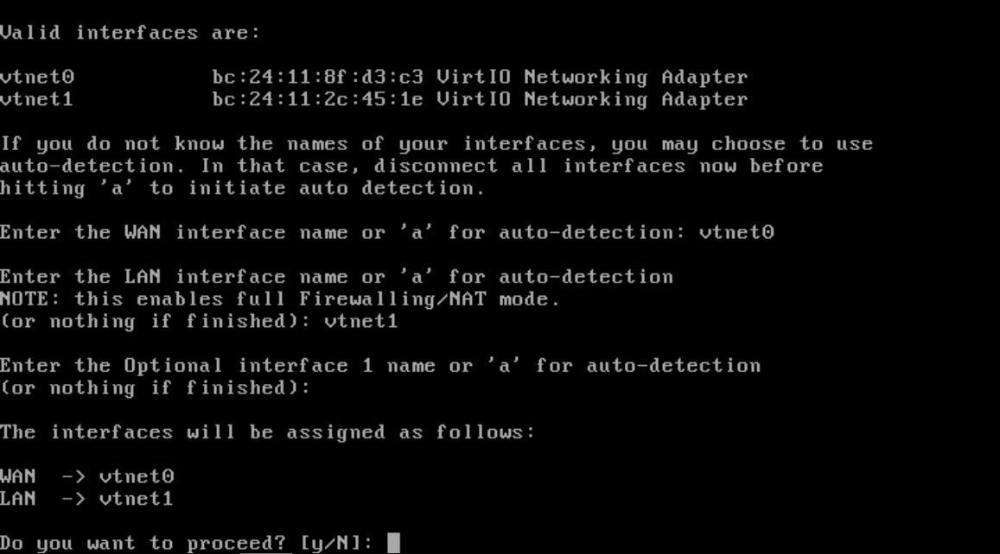

# OPNsense

This guide covers the installation and configuration of OPNsense, an open-source firewall and routing platform. OPNsense runs as a virtual machine and serves as the central gateway, managing all network traffic for the virtualized services. It will be configured to provide essential network services like DHCP and DNS, segment the network using VLANs, and handle advanced functions such as load balancing and reverse proxying.

## Table of Contents

- [OPNsense](#opnsense)
  - [Preparation Steps](#preparation-steps)
  - [Installation](#installation)
  - [Post-Installation Tasks](#post-installation-tasks)

## Preparation Steps

To install OPNsense, download the OPNsense ISO image from the [official website](https://opnsense.org/download). For this setup, we are using version **25.7**.

Once the ISO is downloaded, you need to upload it to Proxmox so it can be used to create a virtual machine.

1. **Navigate to Storage:** In the Proxmox web UI, select your node in the left-hand server view, then click on the `local` storage.
2. **Open ISO Images:** In the center pane, select the `ISO Images` tab.
3. **Upload the File:** Click the `Upload` button. In the dialog that appears, click `Select File` and choose the OPNsense ISO you downloaded.
4. **Confirm Upload:** Click `Upload` again to begin the transfer.

> 💡 To save time, you can download the ISO directly to Proxmox. Instead of `Upload`, click `Download from URL` in the `ISO Images` view, paste the download link, and click `Download`. This avoids having to first download the file to your computer.

After the upload/download is complete, the OPNsense ISO will be available to attach to a new VM during the creation process.

## Installation

- Create the virtual machine for OPNsense. In the Proxmox web UI, click the `Create VM` button in the top-right corner to launch the VM creation wizard. Enable the `Advanced` checkbox in the bottom-right of the dialog. Proceed through each tab and configure the settings as described in the following steps.

### VM Configuration Steps

#### General Tab

- **Name:** `opnsense`
- **VM ID:** `1001`
- **Start at boot:** checked
- **Start/Shutdown order:** `1`

#### OS Tab

- **Use CD/DVD disc image file (iso):** selected
- **Storage:** `local`
- **ISO Image:** `OPNsense-25.7-dvd-amd64.iso`
- **Type:** `Linux`
- **Version:** `6.X - 2.6 Kernel`

#### System Tab

- **Machine:** Default (`i440fx`)
- **BIOS:** Default (`SeaBIOS`)
- **SCSI Controller:** `VirtIO SCSI single`
- **Qemu Agent:** checked

#### Disks Tab

- **Storage:** `local`
- **Disk size (GiB):** `32`
- **Format:** `QEMU image format (qcow2)`
- **Discard:** checked
- **SSD emulation:** checked

#### CPU Tab

- **Cores:** `4`
- **Type:** `host`

#### Memory Tab

- **Memory (MiB):** `2048`
- **Minimum memory (MiB):** `2048`
- **Ballooning Device:** checked

#### Network Tab

- **Bridge:** `vmbr1`
- **Model:** `VirtIO (paravirtualized)`

- Select the newly created VM `1001 (opnsense)` and open the `Console` tab. Click `Start` to power on the VM. The system will boot from the OPNsense ISO in live mode initially.

- At the boot prompt, you can simply wait for the system to autoboot—no user input is required at this stage.

- Once the system begins initialization, you may see prompts to configure certain options. Wait until you see the message: **"Press any key to start the manual interface assignment"** At this point, press any key to proceed with assigning a network interface for WAN.

- You will be prompted to configure LAGGs and VLANs. For both prompts, simply press `Enter` to accept the default answer of "No," as these features are not required at this stage of the setup.

- Next, when prompted for the WAN interface name (as shown in the screenshot below), type `vtnet0` and press `Enter`. This assigns the first network interface as the WAN connection for OPNsense.

- When prompted to enter the LAN or an Optional interface name, leave the field empty and press `Enter`. We will configure the LAN interface later in the setup process.

- Finally, type `y` and press `Enter` to confirm your selections and proceed with the initial network configuration.

- Once the WAN interface is configured and you see the login prompt, you are ready to begin the actual installation of OPNsense onto the virtual machine.

- Log in using the username `installer` and the password `opnsense`. This will launch the OPNsense installer, allowing you to proceed with the guided installation process.

- Select your preferred keyboard layout and continue. When prompted, choose the `Install (UFS)` option to begin the installation. You may see a warning about the system having only 2048 MB of RAM—this can be safely ignored for our setup and usage purposes. Click `Proceed anyway` to continue with the installation process.

- Select the 32 GB disk as the installation target for OPNsense. When prompted about creating a recommended swap partition, choose `No`—this is optional and not required. Confirm your disk selection by choosing `YES` when asked to proceed. The installer will now copy the necessary files and complete the installation process. Wait for the installation to finish before continuing to the next steps.

- Next, you will be prompted to set the `Root password` for the OPNsense system. Enter a strong password of your choice twice to confirm. This password will be used for administrative access to the OPNsense web interface and console.

- After setting the password, select `Complete Install` to finalize the installation. Then choose `Reboot now` to restart the system and complete the initial installation process.

## Post-Installation Tasks
