## Proxmox Installation

### 1. Introduction

Proxmox Virtual Environment (Proxmox VE) is an open-source virtualization platform that enables you to run and manage multiple virtual machines and containers on a single physical server. In this Mukhtabar environment, Proxmox serves as the central hypervisor, allowing efficient resource allocation, isolation, and management of various services and operating systems. By using Proxmox, you can easily deploy, monitor, and maintain virtualized infrastructure components such as firewalls, storage solutions, and application servers, making it ideal for learning, experimentation, and simulating IT infrastructure.

### 2. Prerequisites

#### Hardware requirements

This installation uses a Dell OptiPlex 3060 Micro equipped with an Intel Core i5-8500T processor (6 cores, 6 threads), 64 GB DDR4 memory, a 2 TB M.2 SSD (used for the TrueNAS ZFS storage pool), a 1 TB SATA SSD (dedicated for the operating system), and a Realtek RTL8111HSD-CG Gigabit Ethernet port. These specifications provide ample resources for running Proxmox VE and hosting multiple virtual machines and containers, making it suitable for a variety of homelab and learning scenarios.

#### Operating System (hypervisor)

To install Proxmox VE, download the Proxmox ISO image from the [official website](https://www.proxmox.com/en/downloads/proxmox-virtual-environment). For this setup we are using version **8.4-1**

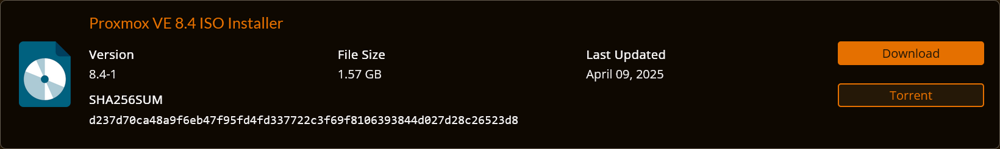

> Use a tool like [Rufus](https://rufus.ie/) or [balenaEtcher](https://www.balena.io/etcher/) to create a bootable USB drive with the ISO. Ensure you have a reliable USB stick (at least 4 GB) and verify the download checksum for integrity before.

#### Preparation steps

Before installing Proxmox VE, **$^1$ Update** the BIOS of your chossen hardware to the latest version available from the official support site. In the BIOS settings, **$^2$ Enable** virtualization technologies (Intel VT-x and VT-d) or (AMD-V), **$^3$ Configure** the boot mode to UEFI for better compatibility and performance and **$^4$ Ensure** USB boot is enabled.
**$^5$ Connect** the system to your network with an Ethernet cable.

### 3. Installation Steps

- #### Insert the prepared USB drive into the machine and power on the system. Select the USB drive as the boot device from the BIOS/UEFI boot menu to start the Proxmox installer. Here select "Install Proxmox VE (Graphical)" you may then read the EULA :wink: and click on "I agree"

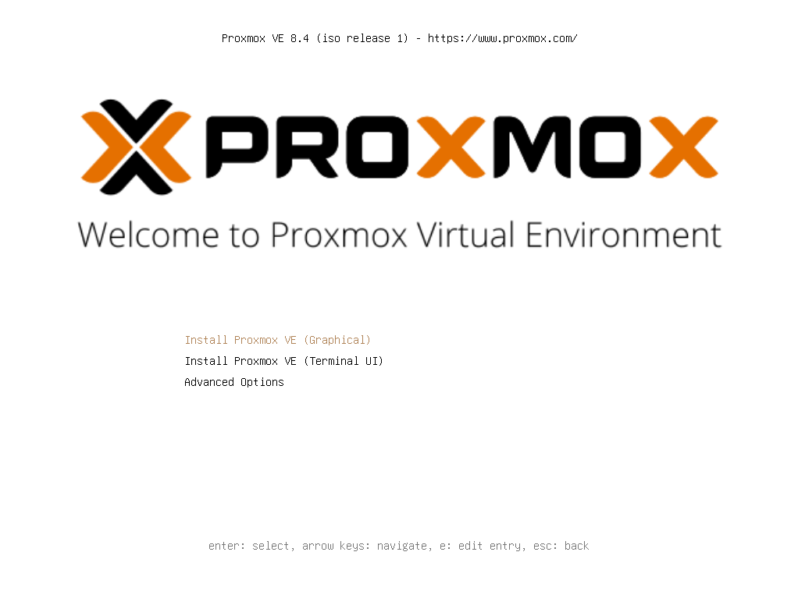


> 💡 Sometimes the graphical installer may have compatibility issues with certain graphics cards, resulting in the screen being cut off at the bottom and preventing you from completing the installation. If you encounter this problem, use the "Terminal UI" option instead, which provides a text-based installation.

- #### Choose the target disk for installation. For this setup, we will use the default option and allow Proxmox to automatically partition the disk.

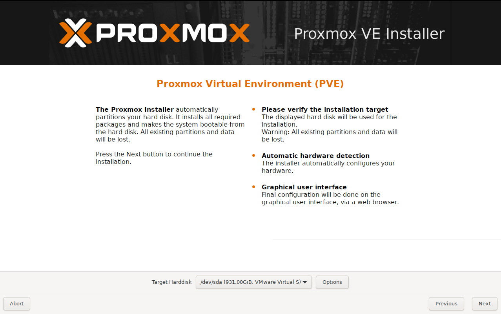

> 💡The disk name shown in the screenshot is "VMware Virtual" because a virtual machine was used to capture the installation process for documentation purposes. On your physical hardware, you will see the actual disk model and size.

> 💡If you have specific reasons or requirements, you can customize the disk partitions during installation by clicking on "Options". Refer to the [Advanced LVM Configuration Options](https://pve.proxmox.com/pve-docs/chapter-pve-installation.html#advanced_lvm_options) in the official Proxmox documentation for detailed guidance.

- #### Select your country, time zone, and preferred keyboard layout. This ensures that your system clock and input settings are correctly configured for your region.

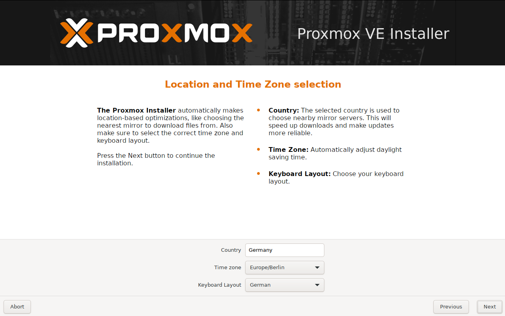

- #### Set a strong password for the root user and confirm it. Enter an email address to receive system notifications from Proxmox. If you do not wish to use a real email, you can enter a placeholder address.

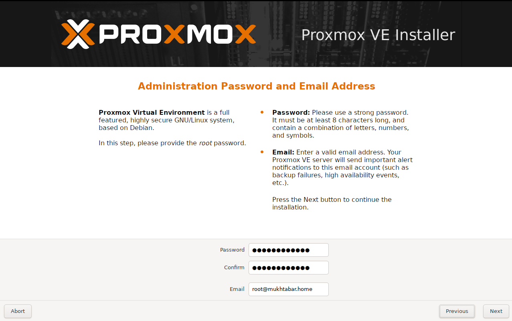

- #### Configure the hostname and domain for your Proxmox server to identify it on your local network. Assign a static IP address, gateway, and DNS server according to your network setup.

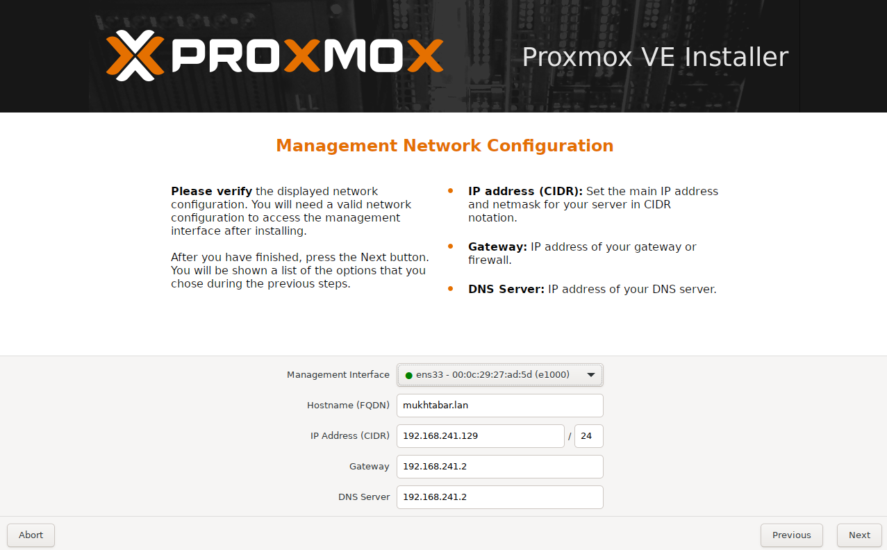

- #### Review all the settings and information on the summary screen to ensure they match your configuration. Once you are satisfied, click "Install" to begin the installation process.

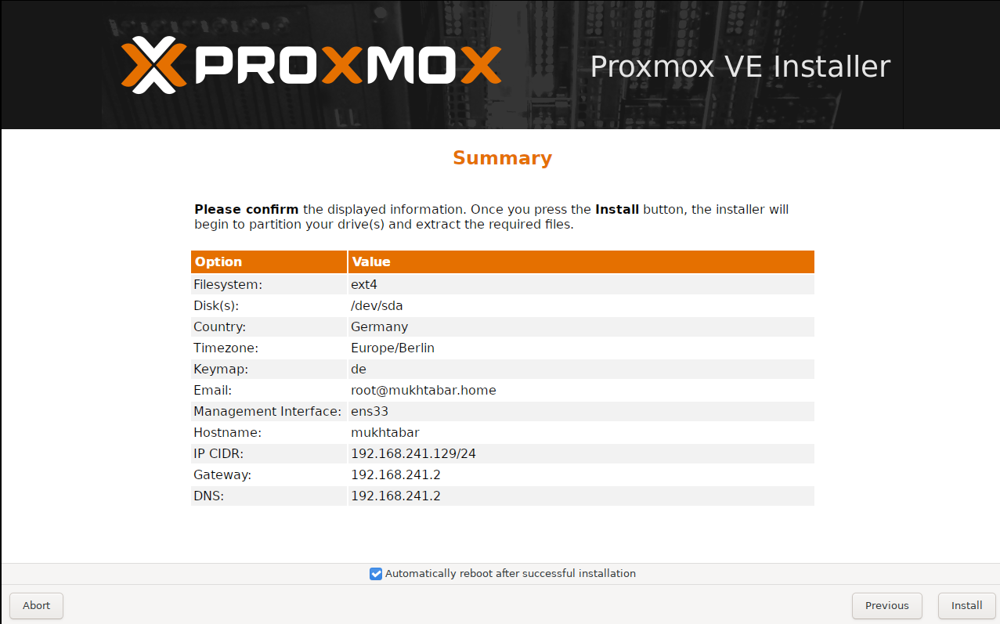

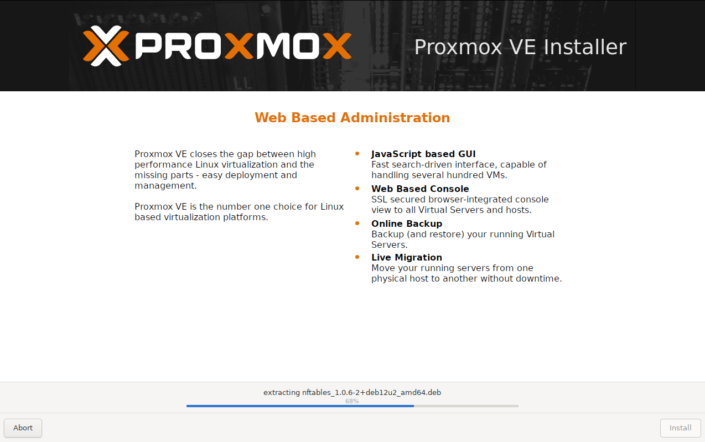

- #### Once the installation is complete, the system will automatically reboot. On startup, Proxmox VE will display the IP address and port (usually `https://your-ip-address:8006`) to access the web interface. Use this address in your browser to log in and begin configuring your Proxmox environment.

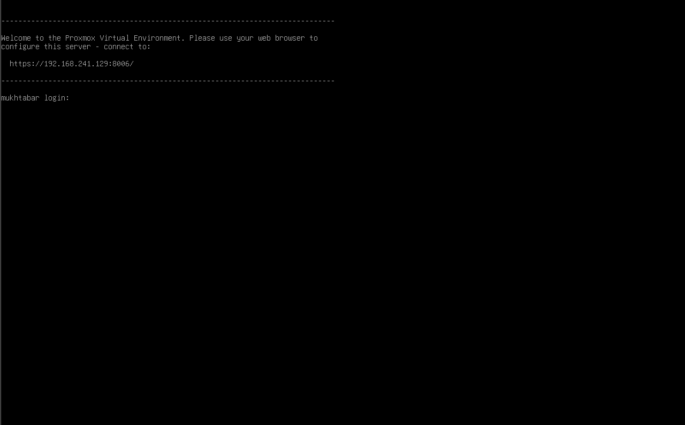

### 4. Post-Installation Tasks

- #### Log in using the username `root` and the password you set during the Proxmox VE installation. This will grant you administrative access to the web interface, where you can begin configuring and managing your virtual environment.

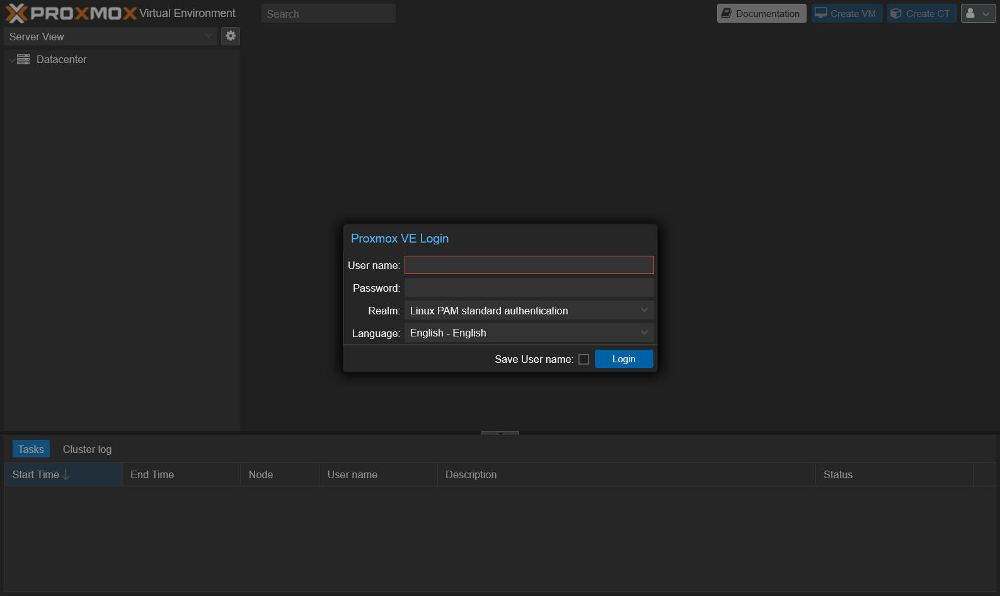

> 💡 After logging in for the first time, you will see a dialog about a subscription. You can simply ignore this message and click "OK" to access the Proxmox web interface. If you wish to remove this notification, there are methods available which will be covered later in the documentation.
> 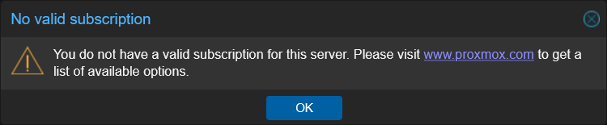

- #### Now that the installation is complete, it's important to update the system and adjust key settings. You don't need to reinvent the wheel—[Proxmox VE Helper-Scripts](https://community-scripts.github.io/ProxmoxVE/) provide a variety of useful scripts to automate tasks. These scripts help streamline your initial configuration, so you can quickly get your environment ready for use.

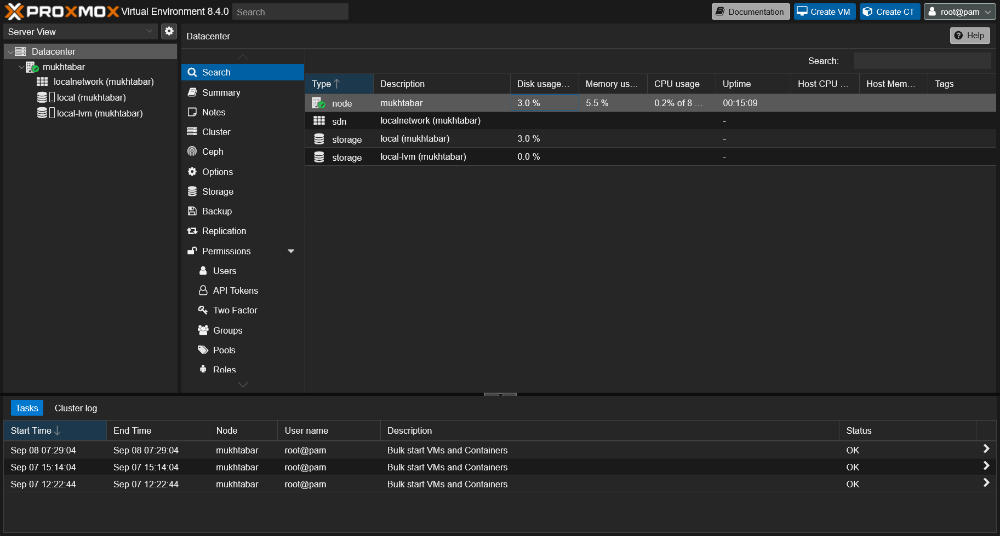

- #### We will be using the [Proxmox VE Post Install Script](https://community-scripts.github.io/ProxmoxVE/scripts?id=post-pve-install) to automate essential post-installation tasks. In the Proxmox web interface, all available nodes are listed on the left—currently, there is only one. Click on your node, navigate to "Shell," and paste the script command from the website to begin running the script and configuring your environment. This script will update repositories, apply system updates, remove the subscription notification, and optimize key system settings for better performance and usability.

- #### After the script finishes running, reboot the system if it has not already been done automatically. You can reboot Proxmox either from the WebUI or by entering the `reboot` command in the shell. This ensures all updates and changes are applied correctly before you proceed with further configuration.

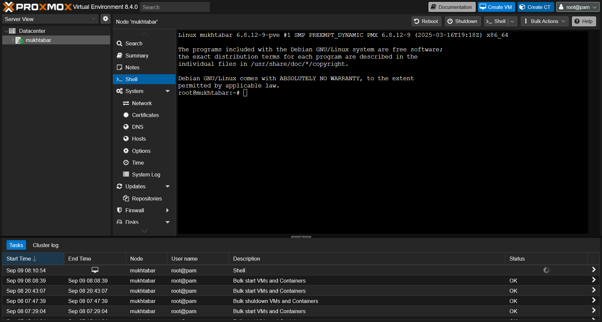

- #### Now we need to enable PCI(e) Passthrough in Proxmox. You can follow the official guide here: [PCI(e) Passthrough](<https://pve.proxmox.com/wiki/PCI(e)_Passthrough>). For this system, perform the following steps in the Proxmox shell:

- #### These steps will enable PCI(e) passthrough support, allowing you to assign physical devices directly to your virtual machines. In this setup, PCI(e) passthrough is required to dedicate the 2 TB SSD to the TrueNAS VM, ensuring optimal performance and direct disk access for storage operations.

1. Update package lists and install a text editor:

   ```bash
   apt update && apt install nano
   ```

2. Edit the GRUB configuration to enable IOMMU. Open `/etc/default/grub` and modify the `GRUB_CMDLINE_LINUX_DEFAULT` line to include `intel_iommu=on`:

   ```bash
   nano /etc/default/grub
   ```

   Change the line to:

   ```bash
   GRUB_CMDLINE_LINUX_DEFAULT="quiet intel_iommu=on"
   ```

   Save and exit.

3. Update GRUB:

   ```bash
   update-grub
   ```

4. Add required kernel modules for PCI(e) passthrough. Edit `/etc/modules` and add the following lines:

   ```bash
   nano /etc/modules
   ```

   Add:

   ```
   vfio
   vfio_iommu_type1
   vfio_pci
   vfio_virqfd
   ```

   Save and exit.

5. Update the initramfs:

   ```bash
   update-initramfs -u -k all
   ```

6. Reboot the system to apply all changes:
   ```bash
   reboot
   ```

- #### Now we need to adjust the disk layout, as LVM is not be necessary for this setup but have certain disadvantages (see 'Directory' in [Storage](https://pve.proxmox.com/wiki/Storage) for more details).

**Steps to remove LVM and expand local storage:**

1. In the Proxmox web interface, click on “Datacenter” and then select “Storage”
2. Click on “local-lvm” and choose “Remove”
   _Note: Removing local-lvm is safe in this fresh install_
3. After removal, click on your node and open the “Shell”
4. Run the following commands to remove the LVM data volume and expand the root volume:

   ```bash
   lvremove /dev/pve/data
   lvresize -l +100%FREE /dev/pve/root
   resize2fs /dev/mapper/pve-root
   ```

Once completed, your “local” storage should increase to the maximum size available on your hard drive.

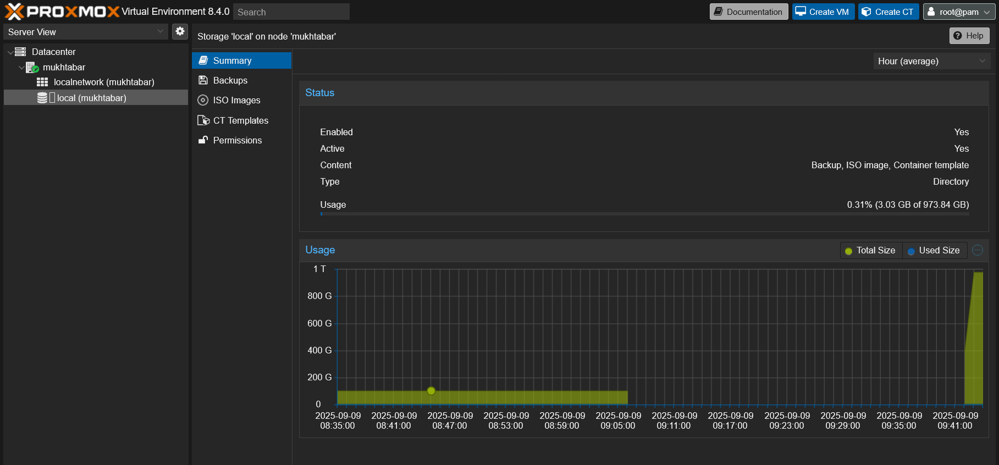
